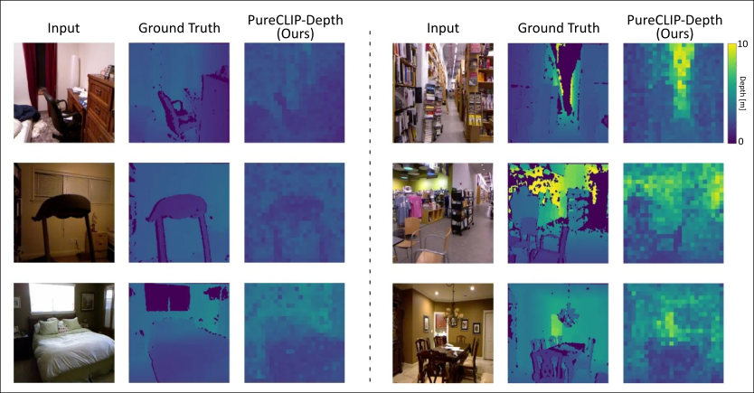

# PureCLIP-Depth: Prompt-Free and Decoder-Free Monocular Depth Estimation within CLIP Embedding Space

We propose PureCLIP-Depth, a completely prompt-free, decoder-free Monocular Depth Estimation (MDE) model that operates entirely within the Contrastive Language-Image Pre-training (CLIP) embedding space. Unlike recent models that rely heavily on geometric features, we explore a novel approach to MDE driven by conceptual information, performing computations directly within the conceptual CLIP space. The core of our method lies in learning a direct mapping from the RGB domain to the depth domain strictly inside this embedding space. Our approach achieves state-of-the-art performance among CLIP embedding-based models on both indoor and outdoor datasets.


Prediction on NYU Depth V2 dataset



Prediction on KITTI dataset


# Getting Started
## Installation

```bash
conda create -n PureCLIP-Depth -y python=3.12
conda activate PureCLIP-Depth

pip install -r requirement.txt

```

## Download pre-trained weight
[Weight for KITTI dataset](https://drive.google.com/file/d/1BI61KmEu86lb-LG9-nJx6xyf6_10ZbNW/view?usp=sharing)

[Weight for NYU Depth V2 dataset](https://drive.google.com/file/d/10ZtuYKioOgk5Y40zxRTj3RVEmKpLMMn-/view?usp=sharing)

## Train the model
```bash
python main_train_nyu.py
```

## References
| Project | Link | Description |
| :--- | :--- | :--- |
| CLIP | [openai/CLIP](https://github.com/openai/CLIP) | Official implementation of CLIP |
| PyTorch | [pytorch/pytorch](https://github.com/pytorch/pytorch) | Tensors and Dynamic neural networks |
