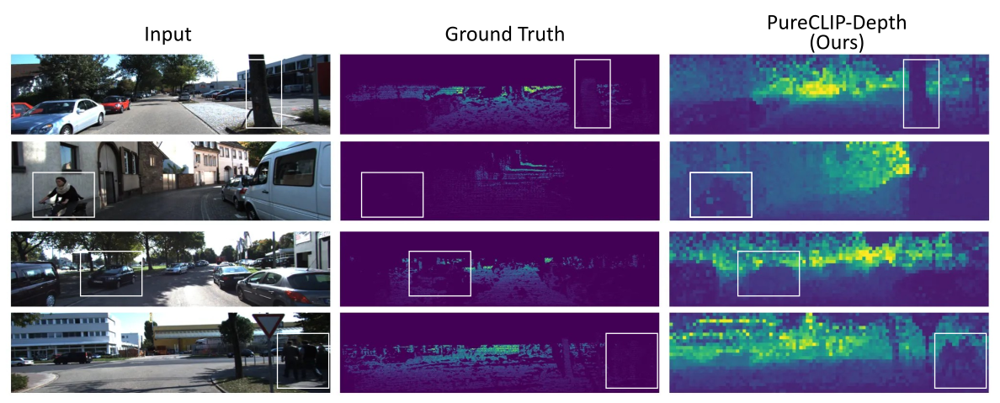

# PureCLIP-Depth: Prompt-Free and Decoder-Free Monocular Depth Estimation within CLIP Embedding Space


We propose PureCLIP-Depth, a completely prompt-free, decoder-free Monocular Depth Estimation (MDE) model that operates entirely within the Contrastive Language-Image Pre-training (CLIP) embedding space. Unlike recent models that rely heavily on geometric features, we explore a novel approach to MDE driven by conceptual information, performing computations directly within the conceptual CLIP space. The core of our method lies in learning a direct mapping from the RGB domain to the depth domain strictly inside this embedding space. Our approach achieves state-of-the-art performance among CLIP embedding-based models on both indoor and outdoor datasets.

# Getting Started

## Train the model
```bash
$ python main_train_nyu.py
```

